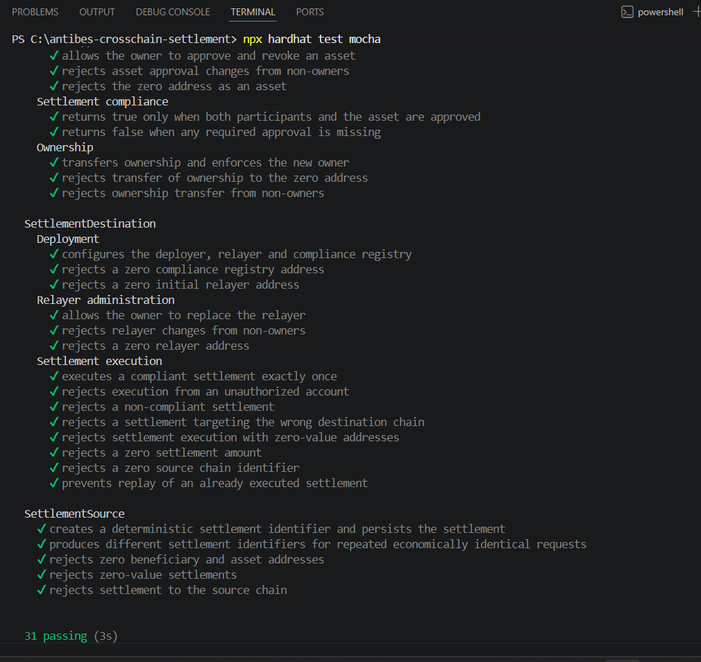
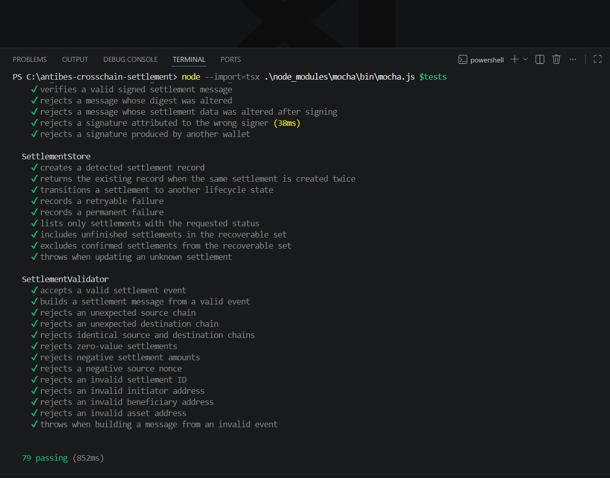
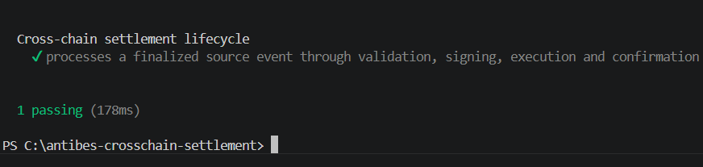
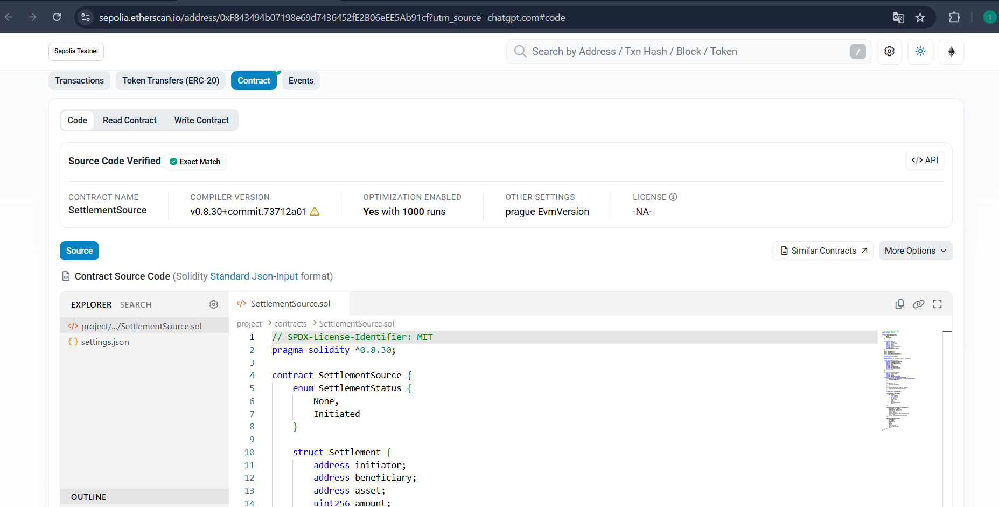

# Antibes Cross-Chain Settlement

A security-focused cross-chain settlement architecture for coordinating asset settlement across EVM networks with explicit compliance enforcement, cryptographic authorization, replay protection, deterministic settlement state, and recoverable off-chain execution.

The system separates source-chain settlement initiation from destination-chain execution and uses an off-chain relayer pipeline to validate finalized events, construct and sign settlement messages, execute authorized destination transactions, and track settlement state through confirmation or recovery.

## Architecture

The project is structured around three on-chain contracts and a TypeScript relayer.

### SettlementSource

`SettlementSource` represents the source-side entry point for settlement initiation.

Responsibilities include:

- deterministic settlement identification
- settlement persistence
- beneficiary and asset validation
- zero-value settlement rejection
- source-chain validation
- settlement initiation state management

### ComplianceRegistry

`ComplianceRegistry` provides an explicit authorization layer for settlement participants and assets.

Responsibilities include:

- participant approval and revocation
- asset approval and revocation
- ownership-controlled administration
- zero-address protection
- settlement compliance checks

A settlement is considered compliant only when the required participants and asset are approved.

### SettlementDestination

`SettlementDestination` controls destination-side settlement execution.

Responsibilities include:

- authorized relayer enforcement
- compliance validation before execution
- destination-chain validation
- zero-value and zero-address protection
- replay protection
- administrative relayer replacement

Each valid settlement can be executed only once.

### Relayer

The TypeScript relayer coordinates the off-chain settlement lifecycle.

Its responsibilities include:

- finalized source-event processing
- settlement validation
- canonical settlement message construction
- cryptographic signing and signature verification
- destination execution
- transaction receipt validation
- persistent lifecycle state
- retryable and permanent failure classification
- recovery of unfinished settlements
- final confirmation handling

## Settlement Lifecycle

```text
Source Chain
    |
    |  Settlement initiated
    v
SettlementSource
    |
    |  Finalized event
    v
Relayer Listener
    |
    v
Settlement Validator
    |
    v
Canonical Message Construction
    |
    v
Cryptographic Authorization
    |
    v
Destination Executor
    |
    v
ComplianceRegistry
    |
    v
SettlementDestination
    |
    |  Replay-protected execution
    v
Transaction Confirmation
    |
    v
Settlement Store / Finality
```

The relayer processes only settlement data that satisfies the expected chain, address, amount, identifier, and authorization constraints before destination execution.

## Security Model

The architecture applies validation and authorization at multiple layers rather than relying exclusively on the relayer.

Key controls include:

| Control | Purpose |
|---|---|
| Participant allowlisting | Restricts settlement participation |
| Asset allowlisting | Restricts eligible settlement assets |
| Relayer authorization | Prevents unauthorized destination execution |
| Signature verification | Protects settlement message authorization |
| Payload integrity validation | Detects settlement data modified after signing |
| Source/destination chain validation | Prevents execution against unexpected chains |
| Replay protection | Prevents an executed settlement from being processed twice |
| Zero-address validation | Rejects invalid critical addresses |
| Zero-value validation | Rejects invalid settlement amounts |
| Ownership controls | Restricts administrative operations |
| Lifecycle persistence | Maintains settlement processing state |
| Failure classification | Separates recoverable from permanent failures |

Further design documentation is available in:

- [`docs/ARCHITECTURE.md`](docs/ARCHITECTURE.md)
- [`docs/THREAT-MODEL.md`](docs/THREAT-MODEL.md)
- [`docs/ADRs.md`](docs/ADRs.md)

## Automated Verification

The project contains separate automated test coverage for the Solidity contracts and the TypeScript relayer.

### Smart Contract Test Suite

The contract suite validates the core settlement and compliance invariants, including administrative authorization, participant and asset approval, destination execution constraints, chain validation, zero-value protection, and replay prevention.



**31 smart contract tests passing**

Representative behaviors include:

- owner-controlled participant and asset approvals
- rejection of unauthorized administrative changes
- deterministic settlement identifiers
- validation of beneficiary and asset addresses
- rejection of zero-value settlements
- destination-chain enforcement
- relayer authorization
- compliance enforcement
- replay protection for executed settlements

### Relayer and Security Test Suite

The relayer suite exercises message integrity, cryptographic authorization, validation, persistence, recovery, execution, and failure handling.



**79 relayer tests passing**

The suite includes coverage for:

- valid signed settlement messages
- altered message digests
- settlement data modified after signing
- signatures attributed to the wrong signer
- signatures generated by another wallet
- source and destination chain validation
- invalid settlement identifiers
- invalid participant and asset addresses
- negative and zero settlement amounts
- settlement lifecycle transitions
- retryable failures
- permanent failures
- recoverable settlement discovery
- confirmed settlement exclusion

### End-to-End Settlement Lifecycle

An integration test validates the complete settlement-processing path from a finalized source event through validation, signing, destination execution, and confirmation.



The integration path verifies that the individual components operate as a coordinated settlement pipeline rather than only as isolated units.

## Sepolia Deployment

The Solidity contracts are deployed to the Ethereum Sepolia test network.

| Contract | Sepolia Address | Verified Source |
|---|---|---|
| `SettlementSource` | `0xF843494b07198e69d7436452fE2B06eEE5Ab91cf` | [Etherscan](https://sepolia.etherscan.io/address/0xF843494b07198e69d7436452fE2B06eEE5Ab91cf#code) |
| `ComplianceRegistry` | `0xbC0a531183a84D13f953033116921A76618Da8ec` | [Etherscan](https://sepolia.etherscan.io/address/0xbC0a531183a84D13f953033116921A76618Da8ec#code) |
| `SettlementDestination` | `0xab974c63AE8b70F24242233d05f3f8f852368e0F` | [Etherscan](https://sepolia.etherscan.io/address/0xab974c63AE8b70F24242233d05f3f8f852368e0F#code) |

### Verified Contract Source

The deployed Solidity source is publicly verifiable on Ethereum Sepolia. The explorer verification provides an independent link between the deployed bytecode and the published contract source.



The repository records public deployment metadata in [`deployments/sepolia.json`](deployments/sepolia.json).

No private keys, RPC credentials, API keys, or other deployment secrets are stored in deployment metadata.

## Repository Structure

```text
antibes-crosschain-settlement/
├── contracts/
│   ├── ComplianceRegistry.sol
│   ├── SettlementDestination.sol
│   └── SettlementSource.sol
│
├── relayer/
│   ├── src/
│   └── test/
│
├── test/
│   ├── ComplianceRegistry.test.ts
│   ├── SettlementDestination.test.ts
│   └── SettlementSource.test.ts
│
├── scripts/
│   └── deploy.ts
│
├── deployments/
│   └── sepolia.json
│
├── docs/
│   ├── assets/
│   │   ├── 31-tests-passed.png
│   │   ├── 79-tests-passed.png
│   │   ├── cross-chain-confirmation.png
│   │   └── source-code-verified.png
│   ├── ADRs.md
│   ├── ARCHITECTURE.md
│   └── THREAT-MODEL.md
│
├── .env.example
├── .gitignore
├── hardhat.config.ts
├── package.json
└── README.md
```

## Technology Stack

- Solidity 0.8.30
- Ethereum / EVM
- Hardhat
- ethers.js
- TypeScript
- Node.js
- Mocha
- Sepolia
- Etherscan
- Sourcify

The Solidity compiler is configured with optimization enabled at 1,000 runs and `viaIR`.

## Design Principles

### Defense in Depth

Critical settlement invariants are enforced across contract and relayer boundaries. Off-chain validation improves operational safety, while destination-side contract checks preserve execution constraints on-chain.

### Explicit Trust Boundaries

The architecture distinguishes between:

- source-chain state
- finalized event observation
- off-chain validation
- cryptographic authorization
- compliance state
- destination-chain execution

This prevents the relayer from implicitly becoming the sole source of trust.

### Deterministic Settlement State

Settlement identifiers and lifecycle state allow individual settlement operations to be tracked consistently across processing stages.

### Replay Resistance

Destination execution records completed settlements and rejects attempts to execute an already processed settlement.

### Recoverable Processing

The relayer distinguishes unfinished and retryable operations from permanent failures, allowing interrupted settlement processing to be recovered without treating every failure identically.

## Local Development

Install dependencies:

```bash
npm install
```

Compile the contracts:

```bash
npx hardhat compile
```

Run the Solidity test suite:

```bash
npx hardhat test mocha
```

Run the complete project test suite:

```bash
npm test
```

Environment-specific credentials must be supplied locally and must never be committed to the repository.

Use `.env.example` as the configuration template and keep the actual `.env` file private.

## Deployment

A Sepolia deployment can be executed with:

```bash
npx hardhat run ./scripts/deploy.ts --network sepolia
```

Contract source verification can be performed with Hardhat after deployment.

Example:

```bash
npx hardhat verify --network sepolia <CONTRACT_ADDRESS> <CONSTRUCTOR_ARGUMENTS>
```

Deployment credentials and API keys are intentionally excluded from source control.

## Scope

This repository focuses on the settlement coordination layer: initiation, compliance authorization, relayer validation, cryptographic authorization, destination execution, replay protection, lifecycle tracking, and recovery.

Production cross-chain infrastructure would additionally require operational decisions around validator/finality policy, key custody, monitoring, alerting, infrastructure redundancy, production RPC strategy, and chain-specific risk controls.

## License

MIT